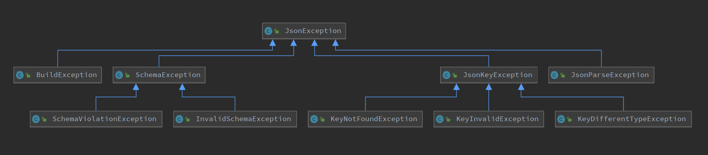

# Java-Json
[](https://github.com/CalumD/Java-JSON)
[](https://github.com/CalumD/Java-JSON)
[](https://www.azul.com/downloads/?version=java-21-sts&package=jdk)
[](https://junit.org/junit5/docs/current/user-guide/)
[](https://github.com/CalumD/Java-JSON/releases)
[](https://maven-badges.herokuapp.com/maven-central/com.clumd.projects/java-json)
[](https://github.com/CalumD/Java-JSON/actions/workflows/CodeQL.yml)

This project attempts to fulfill a very specific niche with json-in-java environments.
> "The use of JSON, primarily as a read-only dictionary of information within your Java application."

The origin story; was to design something to cope with an unpredictable JSON structure, without using external 
dependencies (as I was using it as a core component of my Uni dissertation project).
I also wanted to present a very straight forward API to users with as gradual a learning curve as possible.
Later, Schema support was added, in order to reliably use the part of the JSON which was required for the unpredictable
sections to make sense.

I attempted to follow the official json specification closely, however I do deviate on some specific
points which I hope to detail and justify below.

If you find a problem or think of an improvement, please feel free to raise an issue 
[here](https://github.com/CalumD/Java-JSON/issues). I am very open to constructive feedback.


## Features
- Support for json **without a backing Java class representation**.
    - This is one of, if not thee, headlining feature. Support for, nay, _encouraged_ use of JSON without having to 
    write a Java equivalent version of the object.
    - If you have a data structure defined in JSON, why should you re-write the same thing for Java?

- Javascript style key-based access to data.
    - Rather than nested calls, why not just pass in the whole key to the data you want at once?

- Interface-backed methods for parsing, and specific data type retrieval from your JSON.
    - Extensible / replaceable if necessary - yet easy to integrate to a bigger system.

- Builder support to dynamically build a new JSON object as you go.
    - For those occasions where you really need to go the other way (Java > JSON), I guess we can support that too.

- Fairly sleek error handling hierarchy with (hopefully) helpful and contextual error messages.
    - Ability to catch specific types of problem for more fine-grained reactions.

- Comment support in JSON using // and # for single line, and /**/ for multiline.
    - If beginners are used to having comment support in Java or Python already, I don't see the harm in letting them
    use comments to document JSON to themselves without littering the object itself with '$comment' properties.

- Schema validation support.
    - A comprehensive Schema checker (with some specific limitations -e.g. Schemas must be locally present in full, no
    support is provided for retrieving referenced schemas from some online resource), which can give contextual 
    reasoning as to why an object has failed validation.

- Pretty printing support.
    - The ability to nicely format the output of a Json object, including the ability to specify custom indentation
    levels, and nested depth output.
    - What does 'Nested depth output' mean? Well say you had the following object:
        ```json
        {
          "classification": "foo",
          "email": {
            "domain": ".com",
            "address": "bar",
            "something else": [
              {"way more values":  "..."},
              5
            ]
          }
        }
        ```
        If you only care about the top-level information, you can use the method `toPrettyString()` on the object to
        get output:
        ```json
        {
          <classification,email>
        }
        ```
        However, if you want to see everything until you are as deep as "something else", you can use 
        `asPrettyString(2)` to see 2 levels deep. This is especially useful if you have very large or complex JSON 
        structures with many repeating sub-elements.
        ```json
        {
          "classification": "something",
          "email": {
            "address": "blah",
            "domain": ".com",
            "something else": [
              <2>
            ] 
          } 
        }
        ```


## Usage examples
- A lot of the actual implementation details for this package should (hopefully) be very self-explanatory. Please take a
  good look at all of the interfaces
  [in the api package](src/main/java/com/clumd/projects/javajson/api).

- As mentioned in the [Features](#Features) section, **'Javascript style key-based access to data'** is considered very
important in this project.
    - TL:DR, you should use dot separated keys when referencing objects and their properties, square brackets with
    integer indexes when referencing array elements, and square brackets with (usually backtick, but any string 
    delimiter is fine depending on key contents) string delimiters when referencing properties which have special
    characters or spaces. e.g.
        ```javascript
        "object1[3][1].prop.foo[`look at the spaces`].key"
        ```
      The entire above, should be used in one of the JSON dataType getters.
    - It was actually another of the original project's goals.
    - I wanted the ability to address my values using single strings as a pointer to their location. Much like you
    would do in regular javascript. If you have an object called "me", with various sub properties, the way you would
    access that, is through the ubiquitous 'dot' referencing syntax.
    However since we dynamically build the JSON structure in a mostly static Java object definition environment, I 
    didn't want to HAVE to deal with chaining calls to multiple sub-objects e.g. 
    (`me.getObj("obj1).getObj("obj2").getArr(3)`).
    So while this is supported, the ideal (and hopefully most intuitive method) to address is to just dot-chain what you
    want like so:
        ```java
        me.getBooleanAt("obj1.obj2[3]");
        ```
      If you don't know / care the type of the value at that location, you can use `getAnyAt("")`. For the listing of
      all the other methods available on a JSON Object, please see
      [the specific interface file here](src/main/java/com/clumd/projects/javajson/api/Json.java)!

- Specific Exception Handling
    - One common use case I could see for a user of this package is to react differently based on the type of exception.
    Shown below is the exception hierarchy:
    
    - If you just want to catch anything, then you could just catch `JsonException`. However, for more fine-grained
    control, you can catch just `KeyDifferentTypeException` for example, which is thrown when a value is found at the 
    provided key, but it did not match the requested type. You could use this to implement some default behaviour or to 
    avoid a full crash due to trying to cast some wrong data type somewhere.

- Type-safe value retrieval.
    - If you have a value which you know _should_ be a string, you can ask for a type safe string like so:
        ```java
        myNiceJSONObject.getStringAt("path.to.stringValue.in.json");
        ```

- If using the package locally, you should be able to execute the following command to run all the tests.
    - Testing:
        ```bash
        $ mvn -B test --file pom.xml
        ```
    - Implementing:
        - Just download and link this project source code as a package dependency to your code, then import and use like
        any other dependency.

- Have Useful error messages
    - Another primary goal was to give useful error messages whenever the input provided was erroneous. Shown below is an 
    example of the provided JSON, along with the error message provided as a result.
    However, it is **STRONGLY** recommended to play around with it yourself as to list all, or even a decent subset of the
    validation steps here would be too much. 
        - Input 1:
          ```java
          JsonParser.parse("{'key':1]")
          ```
        - Response 1:
          ```
          exceptions.json.JsonParseException: Invalid object child delimiter.
          Line: 1
          Reached: {'key':1_
          Expected: , / }
          ```
        - Input 2:
          ```java
          JsonParser.parse("{'key:1}")
          ```
        - Response 2:
          ```
          exceptions.json.JsonParseException: Didn't find matching ', before end of string.
          Line: 1
          Reached: {'key:1}_
          Expected: '
          ```

- Building JSON dynamically
    - **There is currently no support for undoing or deleting from a JSON builder**
    - Though it is something I tried to avoid in the original implementation, it was inevitable that there would be a
    request to go from Java into JSON at least once... Introducing the JsonBuilder.
    - JsonBuilder supports the builder pattern, so something like the following code:
        ```java
        BasicJsonBuilder.getBuilder()
                .addString("Str", "hello")
                .addLong("numbers[]", 1)
                .addLong("numbers[]", 2)
                .addLong("numbers[]", 3)
                .addLong("numbers[].numberInObject", 4)
                .addBoolean("this['works too']", true)
                .build();
        ```
      Would yield the following Java-JSON object:
        ```json
        {
          "Str": "hello",
          "numbers": [1, 2, 3, {"numberInObject": 4}],
          "this": {
            "works too": true 
          } 
        }
        ```
      As you can see, to add more elements to an array, you do not need to keep track of which index you are on, you 
      just need to anonymously reference an array, and it will automatically be appended to the end.
    - Additionally, rather than incrementally build up an object in hierarchical order, there is support to dynamically
    create children along the path to the value, if no existing values are found. e.g. the following would still be 
    considered valid: ```JsonBuilder.builder().addLong("would.you.look[0][].at.this['w i l d'][\"path\"].though", 1)```,
    yielding the following JSON: ```{"would":{"you":{"look":[[{"at":{"this":{"w i l d":{"path":{"though":1}}}}}]]}}}```.

- Schema Validation:
    - Firstly, both the Schema and the object to be validated will have to be parsed into a 'Json', so we can be
    confident that the structure of both objects are acceptable (Since a JSON schema is of course JSON itself).
    - We expose two main methods for the validation of an object against a schema.
        - One to validate with reasoning, which will throw an exception if the object fails to satisfy the constraints
        of the given schema, with details as to what caused the failure.
        - Another which will only ever return the boolean status if the validation passed or not and never throw any 
        JsonException any higher up the stack.

## Deviations from specification
As mentioned in the intro, there are some clear areas where this implementation does not support the exact requirements
of the specification. I am referencing content mostly found [HERE](https://json-schema.org/specification.html).

- Max number support
    - The JSON specification does not put an upper or lower bound on the scale of a number, however this implementation
    will not support an integer exceeding Java's Long bounds, or a decimal exceeding Java's Double bounds.

- No null support
    - The choice to not support NULL's still torments me to this day.
    - Ultimately I decided that to a beginner, the concept of nullity as a value is more difficult to get your head
    around than just missing out that key, and I would argue that is the 'more correct' implementation detail for a 
    flexible object structure such as JSON anyway.
    - There is no technical reason why NULL was left out of this implementation, and it may still be added in some
    future version.

- Strings/Keys can be delimited by any of ( `"`, `'`, ``` ` ```)
    - According to the spec, object property keys must be delimited using double quotes. There is no such requirement
    by this implementation, just as there is no such limitation in browser dev consoles for example.
    - ```{'valid key 1': 1, "valid key 2": 'some string value', `valid key 3`: 3}``` are all acceptable here.
    - Delimiters must match however.

- No Schema support for unevaluated(Items/Properties)
    - Where most unknown or unsupported keywords are silently ignored, keywords "unevaluatedItems" and 
    "unevaluatedProperties" are explicitly denied as unsupported.
    - This for two reasons: 1. I think the idea of evaluating properties using a keyword such as unevaluated, is a bit
    of a paradox and is a very extreme edge use-case for the vast number of users. 2. Beginners who are trying to 
    create a Schema for themselves may get this confused with the additional(Items/Properties) keywords.

- No Schema support for HTTP resolution / pointing (e.g. All of the schema must be present in one file.)
    - Schema's, according to the specification, have some very sophisticated sub-referencing logic to allow one schema
    to have one of its validation steps be a pointer to an entirely different schema file hosted at some URL.
    - The lack of this one is mostly down to laziness on my part, in combination with a reluctance to mess around with
    what could end up being waaaay more complex Schema canonical paths according to my implementation than would be
    worth it. Again though, I reckon this is, for the most part, another quite advanced edge case that you are unlikely
    to come across in a simple and effective schema.
